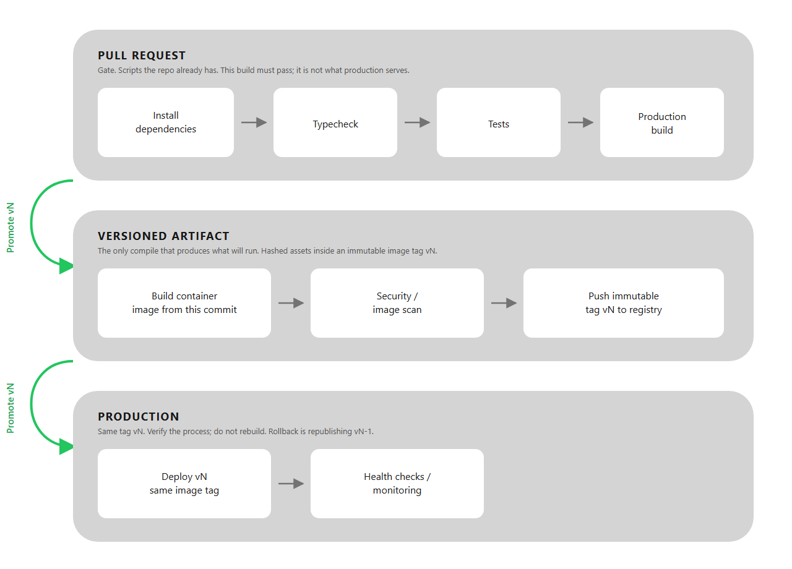

# ADR 003: Validate every pull request, promote immutable artifacts

## Context
A production application needs a repeatable build, validation and deployment process across environments.

The goal is to keep deployments reproducible while preventing changes that fail type checks, tests or production builds from reaching production.

## Decision

Containerize the frontend and API separately and use CI/CD to build, validate and deploy immutable artifacts.

A proposed pipeline is:

## Containerization

Use separate multi-stage Docker builds for the frontend and API.

The frontend build produces static assets that can be served by a lightweight web server or static hosting platform. The API runs independently as a Node service.

Runtime configuration and secrets should be supplied by the deployment environment rather than baked into the images.

## CI

Every pull request should run the checks that currently protect the application:

- dependency installation from the lockfile
- TypeScript typecheck
- automated tests
- production build

Additional security and quality checks can be introduced as the application and deployment environment mature.

## CD

After merge, build each deployable artifact once, assign it an immutable version, and promote the same artifact through environments.

Production deployment should include health checks, observability and a rollback strategy rather than relying only on a successful build.

## Why

Containerization makes the runtime reproducible and separates frontend and API deployment concerns.

Running validation before deployment catches failures early, while immutable artifacts ensure that the version tested in staging is the same version promoted to production.